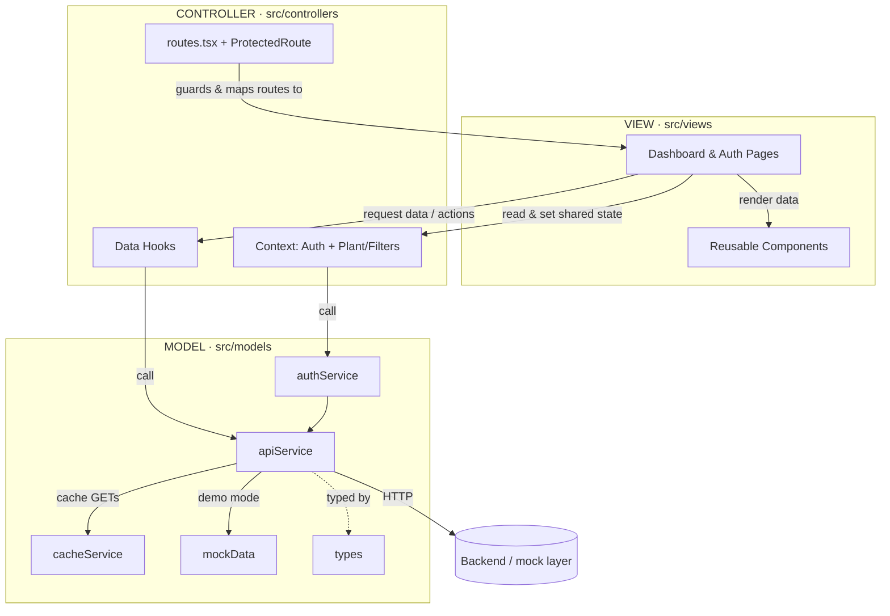

# JM Insights Portal — MVC Architecture

This frontend is a React + TypeScript single-page application organized into a
**Model–View–Controller** layered structure. React itself is component-based, but
the codebase enforces strict separation of concerns that maps directly onto MVC
roles, and it is designed to sit on top of an MVC backend (the SPA is the
backend's "view" tier, and internally re-applies MVC for maintainability).

## Layer mapping

| MVC Role | Folder | Responsibility | Key files |
|----------|--------|----------------|-----------|
| **Model** | `src/models/` | Data, domain types, data-access & business logic. No UI. | `types.ts`, `apiService.ts`, `authService.ts`, `cacheService.ts`, `mockData.ts` |
| **View** | `src/views/` | Presentation only — MUI/JSX rendering of data passed to it. | `components/*` (reusable UI), `pages/dashboard/*`, `pages/auth/LoginPage.tsx` |
| **Controller** | `src/controllers/` | Orchestration — handles user actions, holds state, calls Models, feeds Views, owns routing. | `hooks/*` (per-page data controllers), `context/*` (shared-state controllers), `routes.tsx`, `ProtectedRoute.tsx` |
| Config | `src/config/` | Infrastructure config (not an MVC role). | `environment.ts`, `constants.ts`, `theme.ts` |
| Utils | `src/utils/` | Cross-cutting helpers. | `retry.ts`, `logger.ts` |

### How a request flows through the layers
1. **View** (e.g. `ExecutiveDashboard.tsx`) renders and asks its **Controller**
   for data.
2. **Controller** (`hooks/useExecutiveData.ts`) calls the **Model**
   (`models/apiService.ts`).
3. **Model** performs the call — JWT injection, retry/backoff, caching, and (in
   demo mode) the mock adapter — and returns typed data.
4. **Controller** hands the data back to the **View**, which renders it.
5. User actions (clicking a plant) go View → Controller, which updates shared
   state (`context/plantContext`) and routes onward (`routes.tsx`).

## Folder structure

```
src/
  models/                      MODEL — data + business logic
    types.ts                   domain model (interfaces)
    apiService.ts              central Axios client (interceptors, retry, cache, mock)
    authService.ts             JWT auth logic
    cacheService.ts            TTL cache
    mockData.ts                demo data + resolver
  views/                       VIEW — presentation only
    components/                KPIWidget, ChartContainer, GlobalFilters,
                               Sidebar, Header, Layout, LoadingSpinner
    pages/
      auth/    LoginPage
      dashboard/ Executive, PlantPerformance, AssetHealth,
                 SupplyChain, Sustainability
  controllers/                 CONTROLLER — orchestration + routing
    hooks/                     useApi, useExecutiveData, usePlantData,
                               useAssetData, useSupplyChainData, useSustainabilityData
    context/                   AuthContext, plantContext (shared state)
    routes.tsx                 route table (maps routes -> views)
    ProtectedRoute.tsx         auth/access controller
  config/                      environment, constants, theme
  utils/                       retry, logger
  App.tsx, main.tsx
```

## Layered architecture diagram



## Why this satisfies an MVC review
- **Single direction of dependency:** Views depend on Controllers; Controllers
  depend on Models; Models depend on nothing in the UI. No layer reaches
  "upward."
- **No data logic in Views:** pages never call Axios or touch tokens — they only
  consume Controller output.
- **Centralized Model access:** every network call goes through
  `models/apiService.ts`, so cross-cutting concerns (auth, retry, caching) live
  in one place.
- **Routing as a Controller:** `routes.tsx` maps URLs to Views and
  `ProtectedRoute` enforces access — the classic controller responsibility of
  selecting the view for a request.
